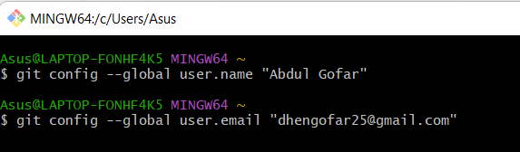

# Github
# Tutorial penggunaan GIT

## 1.Download Git, Buka website (git-scm.com)
Sebelum memulai tutorialnya kalian download programnya terlebih dahulu

## 2.Menambahkan Global Config
Pada saat pertama kali menggunakan git lakukanlah konfigurasi terlebih dahulu user.name dan user.email hal ini perlulu dilakukan agar tidak terjadi eror pada saat kalian melakukan git commit
## Config Global Repository

## 3.Membuat akun di GIT HUB
Login ke akun Git Hub anda atau jika anda belum punya buatlah terlebih dahulu akun Git Hub anda dengan Sign Up dan ikuti Perintahnya

